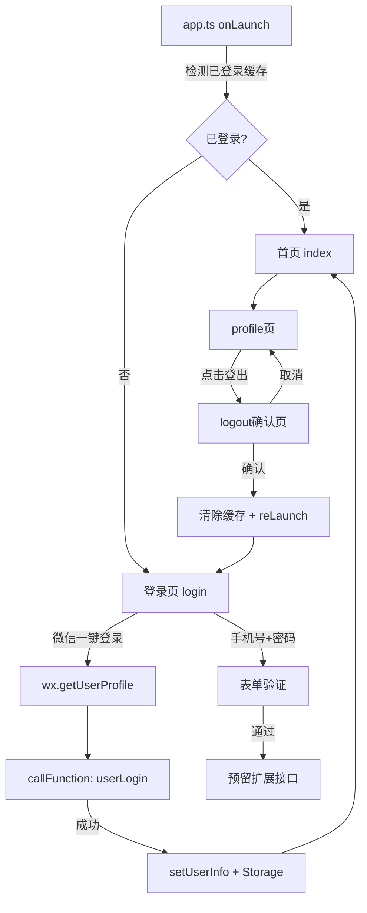

## 用户需求

为"美食记"微信小程序设计并实现简洁现代的登录页和登出确认页，与现有项目 UI 风格保持一致。

## 产品概述

基于微信小程序（TypeScript + LESS）构建两个新页面：

- **登录页（login）**：作为小程序入口页，提供微信一键登录（对接现有 `userLogin` 云函数）和手机号+密码表单（含完整验证，预留扩展接口）
- **登出确认页（logout）**：在 profile 页触发，弹出确认登出提示，含确认和取消操作

## 核心功能

- **登录页**：手机号输入框（格式验证）、密码输入框（非空验证）、记住我开关、登录按钮（含 loading 状态）、忘记密码链接（预留跳转）、微信一键授权登录按钮（真实可用）
- **登出确认页**：登出提示语、确认登出按钮（清除本地缓存+全局状态并跳回登录页）、取消按钮（返回上一页）
- **表单验证**：手机号 11 位格式验证、密码非空检查、错误信息实时提示
- **状态联动**：登录成功后更新 `app.globalData.userInfo`，写入 `wx.setStorageSync`，跳转首页；登出后清除缓存，跳转登录页
- **UI 风格一致**：沿用 `#FF6B35` 主色、`#FFF8F0` 背景、渐变 header、圆角卡片等现有规范

## 技术栈

- 微信小程序原生框架（TypeScript + LESS）
- 云函数调用：`wx.cloud.callFunction`
- 本地存储：`wx.setStorageSync` / `wx.getStorageSync`
- 路由：`wx.reLaunch` / `wx.navigateBack`

## 实现方案

### 整体策略

新增 `pages/login` 和 `pages/logout` 两个页面，注册到 `app.json`。登录页将微信一键登录作为主流程（真实调用 `userLogin` 云函数），手机号+密码表单作为 UI 完整呈现（含验证逻辑，后端预留扩展）。登出页通过 profile 菜单跳转，确认后清空用户状态回到登录页。

### 关键技术决策

1. **登录流程**：微信小程序无传统密码体系，主登录按钮触发 `wx.getUserProfile` 获取用户信息后调用 `userLogin` 云函数；手机号+密码按钮触发本地验证，通过后预留 `callFunction` 扩展点（当前 toast 提示"功能开发中"，保持与项目其他预留功能一致）
2. **记住我**：使用 `wx.setStorageSync('rememberLogin', true)` 持久化；小程序冷启动时在 `app.ts` `onLaunch` 中检测是否已登录并自动跳过登录页
3. **登出页实现**：作为普通页面（非弹窗），保持路由栈可控，通过 `wx.navigateTo` 跳入，取消时 `wx.navigateBack`，确认时 `wx.reLaunch` 回到登录页

### 架构设计



## 实现细节

- **app.json**：将 `pages/login/login` 插入页面列表首位，使其成为默认启动页（tabBar 页不变）
- **app.ts 自动登录检测**：`onLaunch` 中读取 `wx.getStorageSync('userInfo')` 和 `rememberLogin`，存在时直接 `wx.switchTab` 到首页，避免每次启动都显示登录页
- **登录页 loading 状态**：按钮绑定 `isLoading` 防重复提交
- **样式复用**：头部渐变区与 profile 页 `user-header` 样式规范一致，输入框参考 publish 页 `form-input` 样式（白底、16rpx 圆角、32rpx padding）
- **profile 页**：在菜单列表中新增"退出登录"入口，`navigateTo` 跳转 logout 页

## 目录结构

```
miniprogram/
├── app.json                          # [MODIFY] 新增 login/logout 页面路由，login 置顶
├── app.ts                            # [MODIFY] onLaunch 增加已登录自动跳过逻辑
├── pages/
│   ├── login/
│   │   ├── login.wxml                # [NEW] 登录页视图：渐变顶部logo区、手机号/密码表单、记住我、按钮组
│   │   ├── login.less                # [NEW] 登录页样式，沿用项目主色/背景色规范
│   │   ├── login.ts                  # [NEW] 登录页逻辑：表单验证、微信授权登录、云函数调用、storage写入
│   │   └── login.json                # [NEW] 页面配置，navigationBarTitleText: "登录"
│   ├── logout/
│   │   ├── logout.wxml               # [NEW] 登出确认页视图：图标、提示文案、确认/取消按钮
│   │   ├── logout.less               # [NEW] 登出页样式，居中卡片布局
│   │   ├── logout.ts                 # [NEW] 登出逻辑：清除 storage/globalData，reLaunch 到 login
│   │   └── logout.json               # [NEW] 页面配置，navigationBarTitleText: "退出登录"
│   └── profile/
│       ├── profile.wxml              # [MODIFY] 菜单列表新增"退出登录"菜单项
│       └── profile.ts                # [MODIFY] 新增 onLogout 方法，navigateTo logout 页
```

## 设计风格

延续"美食记"现有视觉规范，采用 **暖橙渐变 + 简洁卡片** 风格，与 profile 页保持统一。

### 登录页布局（从上到下）

**顶部渐变区（Hero区）**
背景使用 `linear-gradient(135deg, #FF6B35 0%, #FF8C42 100%)`，高度约 320rpx，居中展示应用 Logo 图标（食物emoji或图片）和应用名称"美食记"，白色文字，底部圆弧过渡到内容区。

**表单卡片区**
白色背景卡片，`border-radius: 32rpx`，`margin: -40rpx 32rpx 0`，`box-shadow: 0 8rpx 32rpx rgba(0,0,0,0.08)`。

- 手机号输入框：带手机图标前缀，`border-bottom: 1rpx solid #f0f0f0`，placeholder 灰色
- 密码输入框：带锁图标前缀，password 类型，右侧显示/隐藏切换
- 错误提示文字：`#FF4444` 红色，12rpx，输入框下方淡入显示
- 记住我行：左侧文字 + 右侧小程序 switch 组件，`color: #FF6B35`

**按钮区**

- 主登录按钮：`#FF6B35` 渐变背景，圆角 48rpx，全宽，白色加粗文字，active 态轻微缩放
- 微信一键登录按钮：绿色 `#07C160`，前缀微信图标，圆角 48rpx，全宽
- 忘记密码链接：居右，灰色 `#999`，字号 26rpx

**底部装饰**
应用 slogan 或版权信息，灰色小字。

### 登出确认页布局

**全页居中卡片**，背景 `#FFF8F0`，页面垂直居中显示白色圆角卡片（`border-radius: 32rpx`）：

- 顶部警示图标（大号emoji 🚪 或 SVG），橙色
- 标题文字"确认退出登录？"，36rpx 加粗 `#333`
- 副文字"退出后需要重新登录才能使用完整功能"，26rpx `#999`
- 两个并排按钮：取消（白底橙色边框文字） + 确认退出（`#FF6B35` 实心背景白字），圆角 48rpx

### profile 页新增登出入口

在菜单列表底部新增一项，图标 🚪，文字"退出登录"，文字颜色使用 `#FF4444`（警示红），区分其他功能入口。

## 使用的 Agent 扩展

### SubAgent

- **code-explorer**
- 用途：在实现登录/登出页过程中，探索现有页面（publish、profile、index）的完整代码结构和 utils 工具函数，确保新页面与现有代码规范完全一致
- 预期结果：获取 utils/storage.ts、现有页面 ts 文件中的云函数调用模式，保证新页面代码风格统一